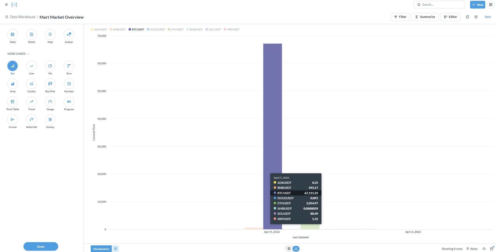
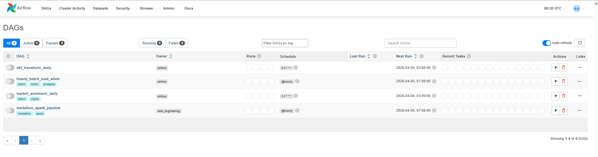
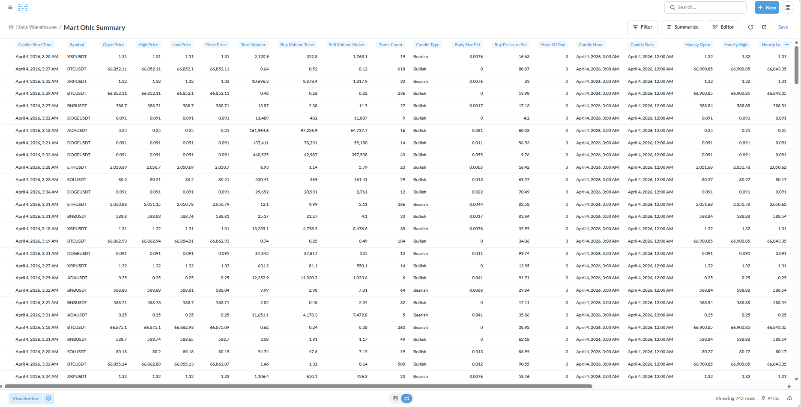
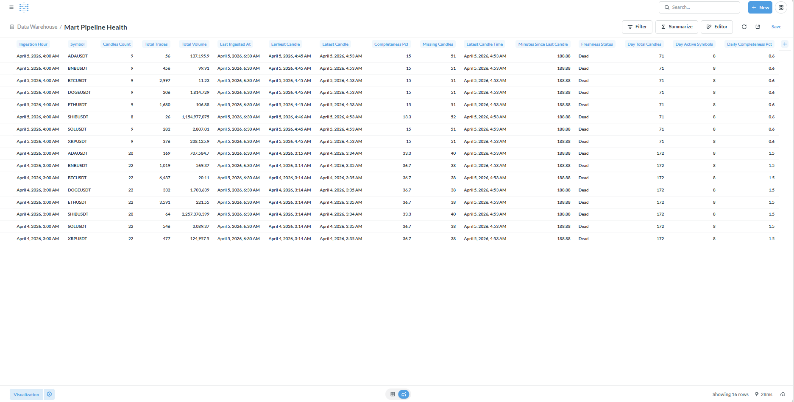

# Binance Data Lake & Analytics Pipeline

This project is a comprehensive, production-grade **Data Engineering Pipeline** designed to ingest, process, and visualize cryptocurrency data from the Binance API. It implements a full modern data stack relying on streaming, distributed computing, and the **Medallion Architecture** (Bronze, Silver, Gold layers) for robust data transformations.

---

## System Architecture

### Overall Data Architecture

The platform architecture is built to support both real-time streaming and batch processing workflows.



### Data Engineering Snapshots

<div align="center">
  
  
</div>
<div align="center">
  
</div>

---

## Table of Contents

1. [Features](#1-features)
2. [Architecture & Tech Stack](#2-architecture--tech-stack)
3. [Project Structure](#3-project-structure)
4. [Prerequisites](#4-prerequisites)
5. [Installation & Setup](#5-installation--setup)

---

## 1. Features

- **Real-Time Data Ingestion**: Uses Kafka and Zookeeper to stream live cryptocurrency market data.
- **Data Lake Storage**: Implements MinIO (S3-compatible) as the primary object storage for raw and processed data.
- **Distributed Big Data Processing**: Uses an Apache Spark cluster (Master/Worker) to process heavy batch data layers.
- **Data Orchestration**: Apache Airflow manages and schedules all data pipelines (DAGs) including dbt transformations, sentiment analysis, and batch jobs.
- **Medallion Architecture**: Employs `dbt` (Data Build Tool) to transform data logically through Bronze (raw), Silver (cleansed), and Gold (aggregate/business) layers into PostgreSQL.
- **Analytics & BI**: Metabase is integrated to provide interactive dashboards and visual insights on the Gold tier data.

---

## 2. Architecture & Tech Stack

### Core Components

- **Message Queue / Streaming**: Kafka, Zookeeper
- **Data Lake (Object Storage)**: MinIO
- **Data Warehouse (Relational)**: PostgreSQL 13
- **Distributed Computing**: Apache Spark 3.5 (Bitnami)
- **Workflow Orchestration**: Apache Airflow 2.7+
- **Data Transformation**: dbt (Data Build Tool)
- **Data Visualization**: Metabase
- **Languages**: Python, SQL
- **Infrastructure**: Docker & Docker Compose

---

## 3. Project Structure

```text
binance_datalake/
├── assets/                     # Architecture diagrams and system screenshots
├── binance_analytics/          # dbt project for data transformations (Bronze -> Silver -> Gold)
├── dags/                       # Airflow DAGs (medalion_dag.py, dbt_dag.py, sentiment_dag.py, etc.)
├── kafka_producer/             # Python scripts to fetch Binance API and produce to Kafka
├── plugins/                    # Airflow custom plugins/operators
├── scripts/                    # Apache Spark jobs and submission scripts
├── docker-compose.yml          # Infrastructure orchestration file
├── dockerfile                  # Airflow custom image build (includes dbt and requirements)
├── dockerfile.spark            # Spark master custom node configuration
├── .env.example                # Template for environment variables
└── requirements.txt            # Python dependencies for the project
```

---

## 4. Prerequisites

To run this pipeline locally, ensure you have the following installed:
- **Docker Desktop** (Make sure to allocate at least 8GB+ of RAM for Spark, Airflow, and Kafka)
- **Docker Compose**
- **Git**

---

## 5. Installation & Setup

### Step 1: Clone the Repository

```bash
git clone https://github.com/adamwhite625/binance_datalake.git
cd binance_datalake
```

### Step 2: Configure Environment Variables

The system relies on various credentials for MinIO, Postgres, and Airflow.

```bash
cp .env.example .env
# Edit the .env file with your specific database passwords, MinIO keys, 
# and (if applicable) your Binance API credentials.
```

### Step 3: Build and Start the Infrastructure

Since this project has a complex cluster of services (Kafka, Spark, Airflow, MinIO, Databases), the initial build and startup may take a few minutes.

```bash
# Build custom images (Airflow and Spark) and start all containers in detached mode
docker-compose up -d --build
```

### Step 4: Accessing the UIs

Once all containers show as "healthy" (you can check with `docker ps`), you can access the various component dashboards:

- **Apache Airflow**: `http://localhost:8081` (Default: admin/admin or as set in `.env`)
- **Apache Spark Master**: `http://localhost:8080`
- **MinIO Console**: `http://localhost:9001`
- **Metabase**: `http://localhost:3000`

### Step 5: Shutting Down

To stop the pipeline and gently shut down all services without losing volume data:

```bash
docker-compose down
```
To wipe all volumes (databases, minio data) and start fresh:
```bash
docker-compose down -v
```
